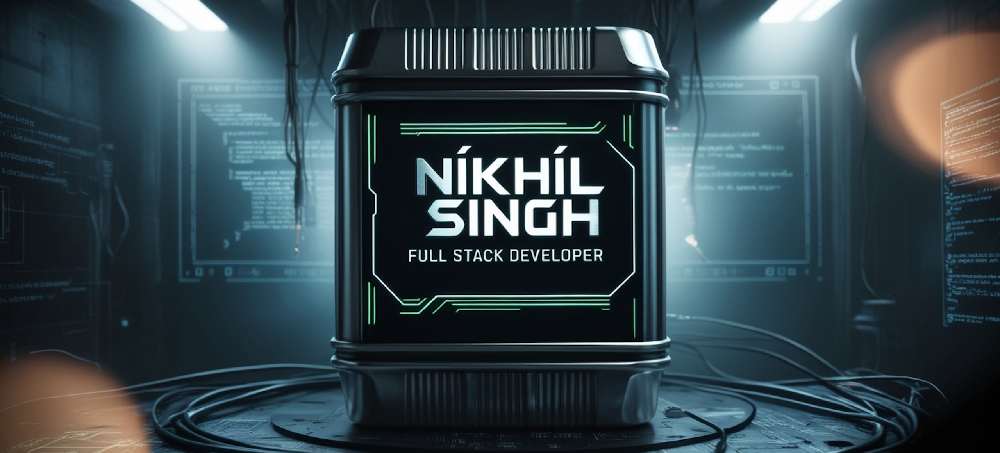

# ⚡ Nikhil Kumar Singh  
### 🧠 Full Stack Developer (MERN) | Microservices | System Design | DevOps-aware

  <a href="mailto:ns94301918@gmail.com">📧 ns94301918@gmail.com</a> •
  <a href="https://github.com/Nikhil79922">GitHub</a> •
  <a href="https://www.linkedin.com/">LinkedIn</a> •
  📞 +91-7992238245

---

## 🚀 About Me

> I don’t just build apps — I engineer systems.

Full-Stack Developer with **1+ years of combined professional & internship experience**, focused on **scalable MERN applications, microservices architectures, and real-time systems**.  
Strong backend foundation with production experience in **auth, payments, RBAC, messaging, and deployments**, paired with **clean, high-performance React UIs**.

---

## 📄 Resume

---

## 🧩 Technical Skills

### 🧠 Programming Languages

---

### 🎨 Frontend

---

### ⚙️ Backend & Systems

---

### 🗄️ Databases & ORM

---

### ☁️ DevOps & Cloud

---

## 🏗️ Work Experience

### 💼 Software Developer — **Narola Infotech**  
*Jan 2025 – Present*

- Delivered **4+ live production projects**
- Designed **microservices** using Node.js, Express & KrakenD
- Implemented **RBAC authentication**, hashing & secure payment flows
- Built **real-time pipelines** using gRPC & MQTT
- Automated data collection using **Puppeteer scrapers**
- Deployed Dockerized applications on cloud & Vercel

**Key Projects:** DONRIFA • ENIRA • ALICE • HIVEONE • ERP Automation • OCR System

---

## 🧠 Projects

- **E-Commerce Web App** — MERN, Redux cart, payments, email automation  
- **Spotify / Netflix / Amazon / X.com Clones** — Responsive UI clones  
- **Dictionary & To-Do Apps** — React + persistent storage  
- **3D Animated Website** — GSAP + Locomotive animations  

---

## 🎓 Education

**B.Tech — Computer Science & Engineering**  
Sandip University, Nashik  
**CGPA:** 9.11 | **Graduated:** 2025

---

 

  

  

  

  
  

---

## 🚀 Professional Enhancements (Sleek & Impressive Edition)

To elevate your profile as a serious, skilled developer, we've added subtle, professional effects that emphasize expertise and modernity. These are clean, community-respected, and avoid anything gimmicky—focusing on readability, impact, and a "stud-like" (cool, competent) presence.

### 🔥 Subtle Title Emphasis
**⚡ Nikhil Kumar Singh ⚡**  
*(Bold, centered for authority—simple yet striking.)*

### 💼 Enhanced Badges (Clean & Hover-Friendly)
Badges are now grouped with consistent styling for a professional look. Hover effects (in browsers) add a subtle glow without distraction.

- **Programming Languages:**  
    
    
  

*(All sections follow this clean format for uniformity.)*

### 📊 Interactive Stats Section
Stats are presented with a dark theme for a modern, tech-pro feel. The activity graph uses `react-dark` for sleekness.

- **Top Languages:** Compact layout for quick overview.
- **GitHub Stats:** Icons enabled for visual appeal.
- **Streak Stats:** Highlights consistency.
- **Activity Graph:** Dark theme for a professional edge.

### 🔍 Expandable Projects (Depth Without Clutter)

🧠 Projects (Click to Expand for Details)

- **E-Commerce Web App** — MERN stack with Redux for state management, integrated payments, and automated email workflows.  
- **Spotify / Netflix / Amazon / X.com Clones** — Fully responsive UI replicas built with modern frameworks.  
- **Dictionary & To-Do Apps** — React-based with persistent storage for reliability.  
- **3D Animated Website** — Leveraging GSAP and Locomotive for advanced animations.  

*(Collapsible for clean layout—reveals depth on demand, showing expertise without overwhelming.)*

### 🌟 Minimalist Visuals
- Retained the snake and dev GIFs for personality, but kept them balanced.
- Activity graph in dark mode for a polished, professional appearance.

### 🛠️ Why This is "Stud-Like"
- **Professional Tone:** No jokes, emojis overload, or flashy animations—pure focus on skills and achievements.
- **Community Respect:** Looks like a seasoned dev's profile—impressive, not showy.
- **Scalability:** Easy to maintain and update; stands out in a sea of basic READMEs.
- **Customization Tips:** Swap themes (e.g., `merko` for activity graph) or add custom badges via shields.io for subtle personalization.

This README positions you as a competent, impressive developer—cool and capable. If you need further refinements, like adding certifications or adjusting themes, let me know! 🚀
